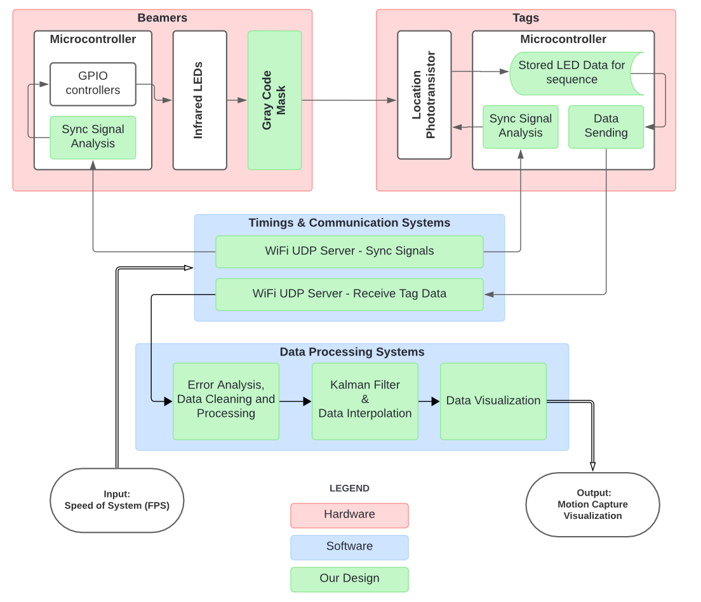

# Motion Capture Lite
Project created as part of the FYDP Capstone (ECE 2024).

Created by: Arjun Mehta, Aryaman Singh, Kevin Kalathil, Nicolas Bao

## Project Abstract
The objective of this project is to build a “lite” motion-capture device that can accurately track small objects that are normally too difficult to track using just a camera. The device uses semi-passive imperceptible markers, which refer to projectors that illuminate small LED marker tags placed on objects. The marker tags are equipped with photosensors to detect light from a projector, and a microcontroller. The markers will process and communicate the results back to a computer where a software tool, through signal processing, converts recorded motion data from the device into 3D motion vectors and allows for real-time tracking.

## Files
- `README.md`: This file.
- `report.pdf`: The final report for the project.
- `poster.pdf`: Poster for Capstone Presentation.

- `beamer_wifi.ino`: Arduino code for the beamers
- `tag_wifi.ino`: Arduino code for the tags
  
- `udp_server.py`: Python code for the server (receives data from the tags)
- `udp_server_calibrate.py`: Optional tool to help calibrate the system
- `visualizer.py`: 3D Visualization tool for tag motion (requires `matplotlib`)

- `rust_sender/*`: Rust code for the sender (sends data to the tags)

- `schematics/*`: Schematics for the project (tag and beamer)
- `old/*`: Old code and files - please ignore!
